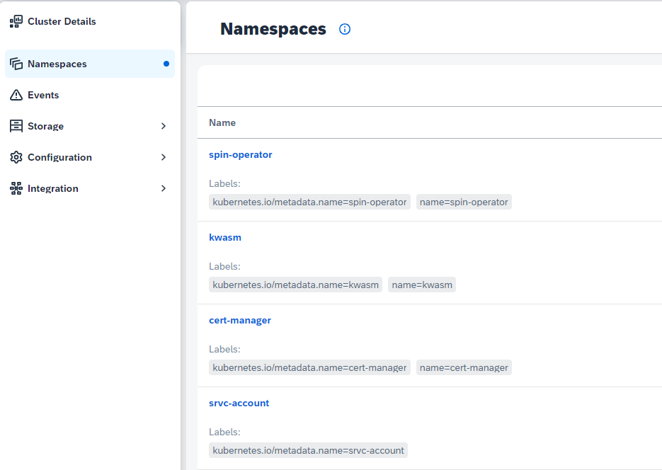
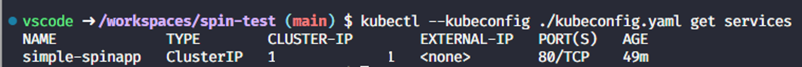
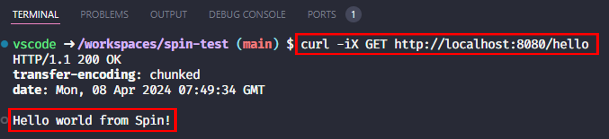

# Giving Kyma a little spin ... a SpinKube

## Introduction

A few weeks ago I stumbled across a webinar about [SpinKube](https://www.spinkube.dev/) that was hosted by and showed a presentation how Zeiss IT validated the project based on their requirements and the promises that come along with the project (["How ZEISS use Wasm in Enterprise - A special livestream"](https://www.youtube.com/live/BwaXNjzbIeI?si=pcqkUmSvtJatE4zK)).

I was impressed and the talk made me curious as the promise that the project "*streamlines developing, deploying and operating WebAssembly workloads in Kubernetes - resulting in delivering smaller, more portable applications and incredible compute performance benefits.*" is quite appealing.

Although I had the project on my radar, I never took a closer look at it. However, now it was the time to give it a spin ... or try. All I needed was a Kubernetes environment. As I am working in the SAP space the choice of Kubernetes is kind of predefined, namely [Kyma](https://kyma-project.io) in its managed version on the SAP Business Technology Platform.


## Making Kyma ready for SpinKube

In general, Kyma provides an opinionated but modular stack of Kubernetes resources that should support especially the SAP ecosystem to build extension and applications. It also allows to bring in own components and this way giving the option to tailor the stack according to the needs of your enterprise. In general, bringing the Spin operator into the stack shouldn't be an issue, but as always: the devil lies in the details, so I wanted to try it out.

In addition, I wanted to check if the Kyma environment on an SAP BTP trial poses some additional constraints on this undertaking, so I decided to use a trial environment for my experiment. Getting a trial environment is straightforward and you find some information about that in the [documentation](https://help.sap.com/docs/btp/sap-business-technology-platform/getting-started-with-trial-account-in-kyma-environment).

### Enabling Kyma

To get started you must first manually enable Kyma in your SAP BTP subaccount. The provisioning takes some time. After that you can access the Kyma console via the URL that is provided in the subaccount overview as well as download the `kubeconfig` file that you need to access the cluster via `kubectl`. To do so you must have the `kubectl` installed on your machine. However, this is not sufficient to access the cluster.

Authenticating with Kyma is a (in my opinion) unnecessary challenge as it leverages the [OIDC-login plugin](https://github.com/int128/kubelogin) for kubectl. You find a description of the setup [here](https://learning.sap.com/learning-journeys/deliver-side-by-side-extensibility-based-on-sap-btp-kyma-runtime/setting-and-configuring-kubectl-for-kyma_b3d25bea-0ef5-498e-bd15-10ef0c23ed06). This works fine when on a Mac but can give you some headaches on a Windows and on Linux machine especially when combined with restrictive setups in corporate environments. For Windows I can only recommend installing [krew](https://krew.sigs.k8s.io/) via [chocolatey](https://chocolatey.org/) and then install the OIDC plugin via `kubectl krew install oidc-login`. At least for me that was the only way to get this working on Windows.

So, we do one extra hop and create a service account that we can use to authenticate with the Kyma cluster.

### Creating a service account

To get rid of the OIDC flow and the browser-based login, the next step I did was to create a *service account* and a `kubeconfig` that contains the necessary roles. The procedure in general is described in a developer tutorial [here](https://developers.sap.com/tutorials/kyma-create-service-account.html).

Quite some adjustments are necessary as you need access a lot more resources, API groups and verbs to get the Spin operator and its dependencies up and running.

Let's quickly walk through the steps:

1. Create a new namespace for the service account. I created a `srvc-account` namespace
2. Create the necessary resources (ClusterRole, ClusterRoleBinding, ServiceAccount) in the `srvc-account` namespace. This was the fun part as I had to jump from error message stating which role I was missing when setting up SpinKube and its dependencies. This is something you can avoid by using this yaml file:

```yaml
apiVersion: v1
kind: ServiceAccount
metadata:
  name: spinkube-service-account
---
apiVersion: v1
kind: Secret
metadata:
  name: spinkube-service-account
  annotations:
    kubernetes.io/service-account.name: spinkube-service-account
type: kubernetes.io/service-account-token
---
kind: ClusterRole
apiVersion: rbac.authorization.k8s.io/v1
metadata:
  name: spinkube-role
rules:
  - nonResourceURLs: 
      - /metrics
    verbs:
      - get
  - apiGroups:
      - ""
      - extensions
      - batch
      - apps
      - gateway.kyma-project.io
      - servicecatalog.k8s.io
      - apiextensions.k8s.io
      - node.k8s.io
      - rbac.authorization.k8s.io
      - admissionregistration.k8s.io
      - coordination.k8s.io
      - cert-manager.io
      - acme.cert-manager.io
      - route.openshift.io
      - certificates.k8s.io
      - authorization.k8s.io
      - gateway.networking.k8s.io
      - networking.k8s.io
      - apiregistration.k8s.io
      - authentication.k8s.io
      - apps
      - core.spinoperator.dev
    resources:
      - deployments
      - replicasets
      - pods
      - pods/log
      - pods/portforward
      - jobs
      - configmaps
      - apirules
      - serviceinstances
      - servicebindings
      - services
      - secrets
      - customresourcedefinitions
      - runtimeclasses
      - serviceaccounts
      - clusterroles
      - clusterrolebindings
      - roles
      - rolebindings
      - mutatingwebhookconfigurations
      - validatingwebhookconfigurations
      - namespaces
      - leases
      - secrets
      - issuers
      - issuers/status
      - certificates
      - certificates/finalizers
      - certificates/status
      - certificaterequests
      - certificaterequests/finalizers
      - certificaterequests/status
      - signers
      - clusterissuers
      - clusterissuers/status
      - events
      - challenges
      - challenges/finalizers
      - challenges/status
      - orders
      - orders/finalizers
      - orders/status
      - routes/custom-host
      - certificatesigningrequests
      - certificatesigningrequests/status
      - subjectaccessreviews
      - gateways
      - gateways/finalizers
      - httproutes
      - httproutes/finalizers
      - ingresses
      - ingresses/finalizers
      - apiservices
      - nodes
      - tokenreviews
      - deployments/status
      - spinappexecutors
      - spinappexecutors/status
      - spinappexecutors/finalizers
      - spinapps
      - spinapps/status
      - spinapps/finalizers
    verbs:
      - create
      - update
      - patch
      - delete
      - get
      - list
      - watch
      - deletecollection
      - approve
      - sign
---
kind: ClusterRoleBinding
apiVersion: rbac.authorization.k8s.io/v1
metadata:
  name: spinkube-role-binding
subjects:
  - kind: ServiceAccount
    name: spinkube-service-account
    namespace: srvc-account
roleRef:
  kind: ClusterRole
  name: spinkube-role
  apiGroup: rbac.authorization.k8s.io
---
```

3. Create the `kubeconfig` file that you can use to access the cluster with the service account. Depending on your OS you can create a script that fetches the token from the secret and creates the `kubeconfig` file. You find the code of the script in step 4 of the [tutorial](https://developers.sap.com/tutorials/kyma-create-service-account.html). 

With this we have the basic setup to provision SpinKube into the Kyma cluster.

> **Note** - You find all the resources and code snippets in GitHub repository [here](service-account/).

### Installing SpinKube

The SpinKube documentation provides tutorials to setup SpinKube locally as well as on clusters. There is one specific tutorial for [Azure Kubernetes Service (AKS)](https://www.spinkube.dev/docs/spin-operator/tutorials/deploy-on-azure-kubernetes-service/) that I used as a reference. Besides the first Azure specific section the SpinKube specific steps are the same for any Kubernetes cluster. Fortunately, Kyma makes no difference here, so I could execute the different steps without any issues.

From a tooling perspective you need to have `kubectl` and `helm` installed. I created a devcontainer with these tools installed.

To give you a rough idea what will be deployed into the Kyma cluster, here is a list of the components that are part of the SpinKube setup:

1. Deploy the Spin Operator CRD and the runtime class [link](https://www.spinkube.dev/docs/spin-operator/tutorials/deploy-on-azure-kubernetes-service/#deploying-the-spin-operator)
2. Install the cert manager to automatically provision and manage TLS certificates.
3. Install the [kwasm](https://kwasm.sh/) operator via helm
4. Install the spin-operator via helm
5. Deploy the [shim executor](https://www.spinkube.dev/docs/glossary/#spin-app-executor-crd) for the Spin application.

Once you are done the installed components are reflected in the new namespaces:



Time to check if the setup is working.

### Deploy the first application

The team behind SpinKube provides some sample apps in their spin operator [repository](https://github.com/spinkube/spin-operator/) that you can use to test the setup and deploy a simple hello world app. Make sure that you reference the *raw* file from GitHub via:

```bash
kubectl apply -f https://raw.githubusercontent.com/spinkube/spin-operator/main/config/samples/simple.yaml
```

First we check that the service is available:



Looks good, so after a port-forward via:

```bash
kubectl port-forward services/simple-spinapp 8080:80
```

you can access the sample app via curl:



So full success, SpinKube is up and running in a Kyma environment.

## But why ...?

First of all, I wanted to see if there are technical obstacles that the Kyma environment might have that prevent the installation of SpinKube. As you can see there are none even on a trial landscape.

Besides the technical feasibility the question that remains is: Why would you want to use SpinKube in a Kyma environment? The answer is SpinKube's value proposition mentioned in the beginning: a tool to deploy WebAssembly modules into a Kubernetes environment which can be useful in various scenarios, especially when you want to deploy small, portable, and fast applications. This makes it possible to optimize the utilization of your cluster and/or use smaller clusters for the same workload.

Of course, the full prove is still not given, as I just deployed a sample app, but the first step is done. Also keep in mind that the SpinKube project is not yet recommended for productive usage, but I think it is a very good point in time to make your first evaluations with it.
